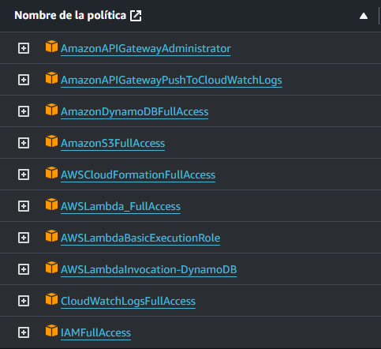
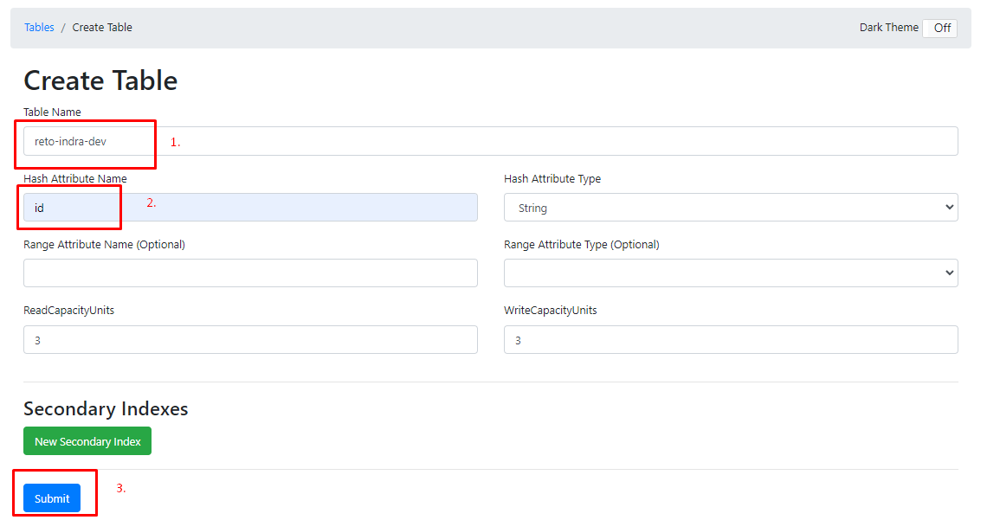
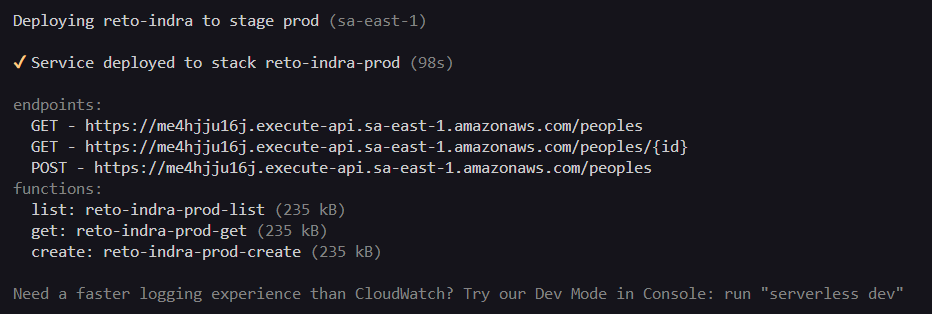

# SWAPI-LAMBDA

API "The Star Wars API" realizada en NodeJS bajo el framework serverless para despliegue en AWS.


## Prerequisitos

- Tener instalador Docker para DynamoDB en local.
- Tener configurado el usuario AWS CLI con los permisos correspondientes.


## Ejecutar proyecto localmente

### Clonar el proyecto

```bash
  git clone https://github.com/drusystem/aws-lambda-nodejs-typescript-dynamodb.git
```

### Ingresar a la carpeta del proyecto
```bash
  cd aws-lambda-nodejs-typescript-dynamodb
```

### Instalar dependencias
```bash
  npm install
```

### Desplegar contenedor docker
```bash
  docker-compose up -d
```

### Crear tabla "reto-indra-dev" en el contenedor de dynamodb-local
```bash
  http://localhost:8001/create-table
```


### Configurar variables de entorno en el archivo "serverless.yml"
```bash
  STAGE: ${sls:stage}
  DYNAMODB_TABLE: ${self:service}-${sls:stage}
  SWAPI_URL: https://swapi.py4e.com/api
```

### Inicializar servicio local
```bash
  npm run start
```
### Opcional
  Generar el build de la aplicación ( dist / .serverless)
```bash
  npm run build
```

## APIS disponibles
### Listar personas de SWAPI
```bash
  GET http://localhost:3000/peoples
```
### Obtener una persona por id de DynamoDB
```bash
  GET http://localhost:3000/peoples/${id}
```

### Obtener una persona por id de SWAPI
```bash
  GET http://localhost:3000/peoples/${id}
```

| Headers | Type     | Description                |
| :-------- | :------- | :------------------------- |
| `provider` | `string` | Se debe enviar el valor de **external_api** para que la API valide que debe obtener la data de SWAPI |

### Crear persona en DynamoDB
```http
  POST http://localhost:3000/peoples
```
| Body | Type     | Description                |
| :-------- | :------- | :------------------------- |
| `nombre` | `string` | Campo **Requerido** |
| `altura` | `string` | Campo **Requerido** |
| `masa` | `string` | Campo **Requerido** |
| `color_pelo` | `string` | Campo **Requerido** |
| `color_piel` | `string` | Campo **Requerido** |
| `color_ojos` | `string` | Campo **Requerido** |
| `anio_nacimiento` | `string` | Campo **Requerido** |
| `genero` | `string` | Campo **Requerido** |
| `mundo_natal` | `string` | Campo **Requerido** |
| `peliculas` | `array[string]` | Campo **Requerido** |
| `especies` | `array[string]` | Campo **Requerido** |
| `vehiculos` | `array[string]` | Campo **Requerido** |
| `naves_estelares` | `array[string]` | Campo **Requerido** |


## Producción

### Despliegue
  Antes de ejecutar el deploy, verificar se cumpla los requisitos previos definido en la sección Prerequisitos respecto a los permisos IAM del usuario asignado al AWS-CLI.
```bash
  npm run deploy
```


### Desistalación
  Al remover las funciones lambda, se retirará todos los servicios relacionados a ello que fueron creados por el deploy.
```bash
  npm run remove
```


## Autor

- [@drusystem](https://www.github.com/drusystem)

